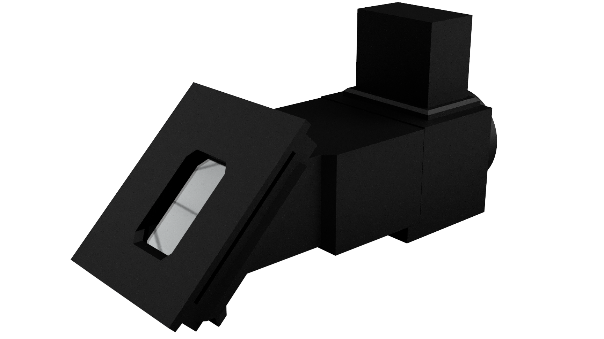
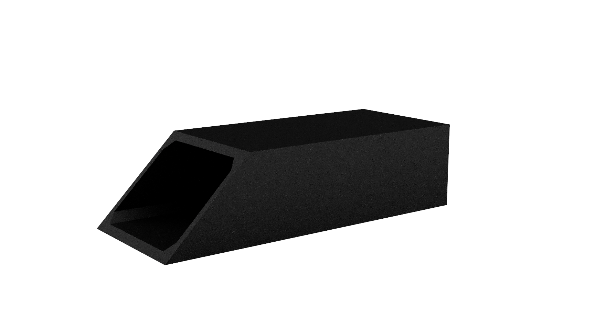
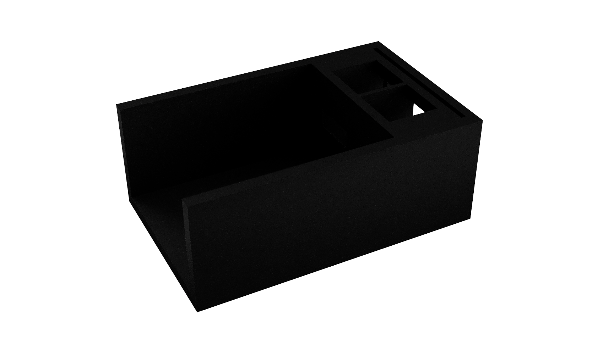
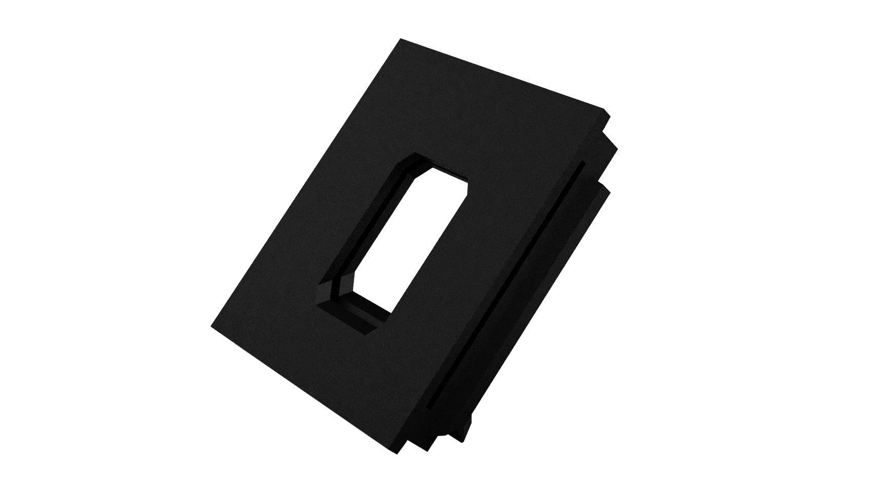
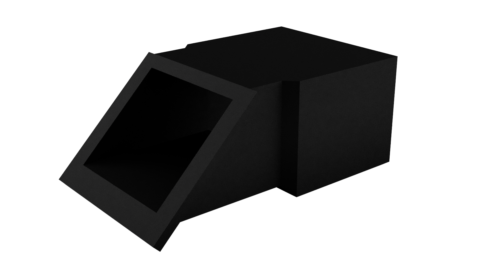
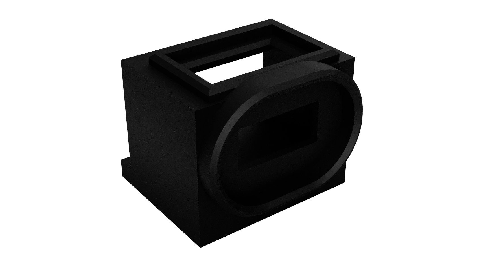
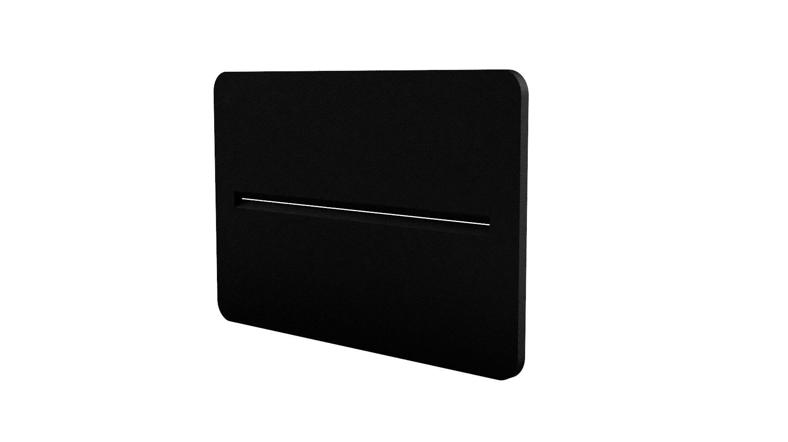
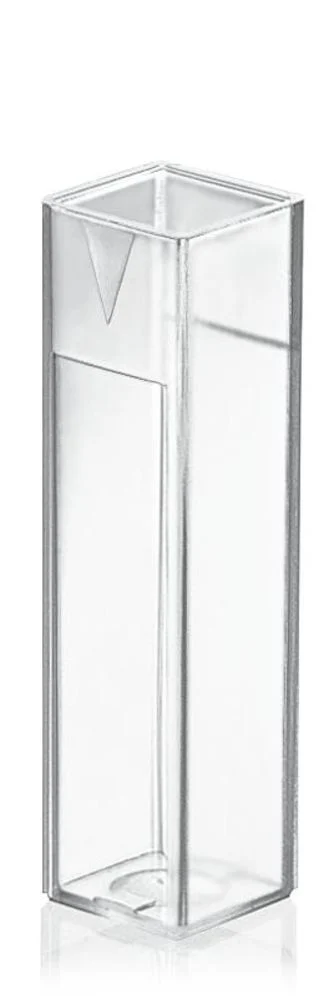
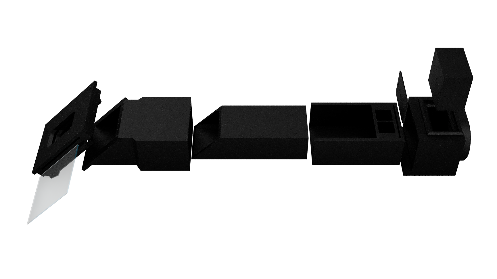

# The double-beam spectrophotometer
## Assembly and use manual for students and teachers




<div class="cover-footer">

**Manual v1 · 2026** | Hardware license: CC BY-SA 4.0

Based on: Winters, B.J. et al. (2021). *3D-Printable and open-source modular smartphone visible spectrophotometer.* HardwareX, 10, e00232. https://doi.org/10.1016/j.ohx.2021.e00232

STL files and documentation: https://osf.io/7ewb3

</div>

---

## Table of Contents

1. [What is light?](#1-what-is-light)
2. [What is a spectrophotometer?](#2-what-is-a-spectrophotometer)
3. [How does our spectrophotometer work?](#3-how-does-our-spectrophotometer-work)
4. [Spectrophotometer components](#4-spectrophotometer-components)
5. [Step-by-step assembly](#5-step-by-step-assembly)
6. [How do we measure?](#6-how-do-we-measure)
7. [Calibrating the instrument](#7-calibrating-the-instrument)
8. [Experiments](#8-experiments)
9. [Troubleshooting: What do I do if it doesn't work?](#9-troubleshooting-what-do-i-do-if-it-doesnt-work)
10. [References](#10-references)


---

## 1. What is light?

Light is a form of energy that travels as electromagnetic waves. What we see with our eyes, the colors of the rainbow, from violet to red, represents only a small portion of a much broader spectrum.

```
Wavelength (nm):
  100        400   450   500   550   600   650   700       1000+
   |          |     |     |     |     |     |     |          |
[Far UV]  [Violet][Blue][Green][Yellow][Orange][Red]  [Infrared]
             ←——————— Visible to the human eye (380–700 nm) ————————→
```

> **💡 Did you know?**
> A rainbow is nothing more than sunlight separated into its component colors by raindrops, which act like tiny prisms. Our spectrophotometer does the same thing, but in the lab!

---

> **💡 Did you know? The human body emits light!**
> Any object with a temperature above −273°C (absolute zero) emits electromagnetic radiation. The human body, at ≈37°C, emits **infrared** light, invisible to the eye, but detectable with thermal cameras. This phenomenon is called **black body radiation**, described by physicist Max Planck in 1900.
>
> The hotter an object is, the shorter its dominant wavelength:
> - Human body (≈37°C) → infrared (≈9,000 nm)
> - Red-hot iron (≈700°C) → visible red (≈700 nm)
> - The Sun (≈5,500°C) → yellow-green (≈500 nm)
> - A hot blue star (≈20,000°C) → ultraviolet
>
> Spectroscopy allows us to "read" the temperature and chemical composition of any light source!

---

## 2. What is a spectrophotometer?

A **spectrophotometer** is an instrument that:
1. **Separates** light into its component colors (spectrum)
2. **Measures** how much light a substance absorbs or emits at each color (wavelength)

There are two main types of measurements we can make:

| Type of spectroscopy | What we measure | Examples |
|----------------------|-----------------|---------|
| **Emission** | Light produced directly by a source | Bulbs, flames, plasma, stars |
| **Absorption** | Light absorbed by a transparent substance | Colored solutions, filters, chlorophyll |

> **💡 Did you know? Every atom has a light "fingerprint"!**
> Atoms emit and absorb light only at certain precise wavelengths, like a unique barcode. This allowed scientists to discover the chemical elements in **the Sun and stars** without ever visiting them! For example, helium was first discovered on the Sun (in 1868) and only 27 years later on Earth.

This capability makes the spectrophotometer useful in:
- **Chemistry:** determining solution concentrations
- **Biology:** analysis of pigments, chlorophyll, proteins
- **Astronomy:** identifying elements in stars
- **Forensics:** trace substance analysis
- **Food industry:** quality control

Commercial spectrophotometers cost between **€400 and €6,000** [1]. The one we are building costs **approximately €25** in parts and uses a **smartphone** as a detector, without sacrificing accuracy [1].

---

## 3. How does our spectrophotometer work?

The DBS (*Double-Beam Spectrophotometer*) works as follows:

```
  LIGHT SOURCE
       │
       ▼
  [Narrow slit]  ← 3D-printed (DBS23 card)
       │
       │  beam 1 → passes through the SAMPLE (solution to be analyzed)
  [Sample holder]
       │  beam 2 → passes through the REFERENCE (pure water / solvent)
       │
       ▼
  [Diffraction grating]  ← 1000 lines/mm; separates colors like a prism
       │
       ▼
  [Smartphone / USB camera]
       │
       ▼
  [ImageJ software] → intensity vs. wavelength graph
  [Naked eye]       → visible spectrum directly in image
```

**Note for emission spectroscopy:** When studying light emitted directly by a source (bulb, flame, plasma), cuvettes are no longer needed. We point the spectrophotometer directly at the source and observe its emission spectrum.

### What is a diffraction grating?

A diffraction grating is a surface with thousands of parallel lines engraved per millimeter. When light hits these lines, different wavelengths (colors) are deflected at different angles, just like a prism, but more efficiently. Our grating has **1000 lines per millimeter** [1].

### Why "double-beam"?

The double-beam design is essential for accuracy in absorption spectroscopy [1]:
- The **upper beam** passes through the **sample** to be analyzed
- The **lower beam** passes through the **reference** (pure water or solvent)

The camera captures both beams simultaneously in the same image. By comparing the two spectra, we eliminate errors caused by fluctuations in the light source.

### The Beer-Lambert Law: the relationship between color and concentration

The more concentrated a solution is, the more light it absorbs. This relationship is described by the **Beer-Lambert Law** [1]:

```
Absorbance (A) = −log₁₀ (P / P₀)
```

- **P₀** = intensity of the reference light
- **P** = intensity of light after passing through the sample
- Absorbance = 1 → the sample absorbed 90% of the light
- Absorbance = 2 → the sample absorbed 99% of the light

---

## 4. Spectrophotometer components

The spectrophotometer is made from 3D-printed parts and a few purchased components. Here are the main parts:

### 4.1 Slit Tube (DBS01)


*An elongated rectangular tube with one end cut at an angle; the angled face allows light from the slit to enter and directs it toward the sample.*

**Role:** Guides light from the source to the sample, keeping the beam narrow and straight. Mounts into the Sample Holder and interlocks with the Tube Adapter (DBS04) for rigidity.

---

### 4.2 Sample Holder / Slit Mount (DBS02)


*A solid rectangular block with two compartments visible on the upper right; these are the cuvette slots for the sample and reference solutions. DBS02 also directly houses the slit assembly (DBS23 wedges and scalpel blades).*

**Role:** The central piece of the instrument. Contains two cuvette slots (sample and reference) and directly houses the slit sub-assembly (DBS23 + blades). Light passes through the slit and both cuvettes simultaneously, creating the two beams.

---

### 4.3 Grating Mount (DBS03)


*A rectangular plate with a central window/opening where the diffraction grating film is inserted. The stepped edges ensure the grating is held at the precise angle relative to the light beam.*

**Role:** Holds the diffraction grating (1000 lines/mm film) at the correct angle relative to the light beam. The camera/smartphone holder also mounts onto it.

---

### 4.4 Tube Adapter (DBS04)


*A cubic box with one face cut at an angle and open; creates the dark chamber between the sample holder and the diffraction grating, shielding the beam from ambient light.*

**Role:** Provides the mechanical connection between the Sample Holder and the Grating Mount. The Slit Tube (DBS01) extends through it and interlocks with DBS03, ensuring rigidity and ambient light-tightness [1].

---

### 4.5 Source Adapter (DBS05)


*A cubic block with an oval opening on the front face (for the light source) and a bracket on top. The oval shape centers the light beam toward the slit.*

**Role:** Mounts on the end of the sample holder facing the light source. Adapts different types of sources (flashlight, LED pen) to the instrument body.

---

### 4.6 Slit Card (DBS23)



*A thin rectangular plate with rounded corners and a narrow horizontal slit in the center, 3D-printed directly into the card. Mounts in front of the sample in the Sample Holder (DBS02).*

**Role:** The card carries the **light slit**, the most delicate part of the instrument. The slit is 3D-printed directly into the card. The slit width determines the spectral resolution.

> **💡 Experiment!** Custom slits can be made from black cardboard using a craft knife. This lets you test the importance of slit width: a narrower slit gives better spectral resolution but allows less light through.

---

### 4.7 Cuvettes (CV01)



*Disposable PMMA (Polymethyl methacrylate) macro cuvettes, 2.5–4.5 ml volume, with a standard 10 mm optical path.*

**Role:** Hold the liquid samples (and the reference solution) during absorption measurements. PMMA cuvettes are transparent in the visible range (380–700 nm) and are single-use, preventing cross-contamination between experiments.

---

## 5. Step-by-step assembly


*Exploded view of the spectrophotometer: from left to right, the slit mount with diffraction grating, the sample holder (central piece with cuvette slots), the tube adapter, and the grating mount with the camera/smartphone holder.*

### Step 1: Installing the slit card

The light slit is **3D-printed directly** into card DBS23, which slides into the Sample Holder (DBS02).

**You need:** DBS02 (1×), DBS23 (1×)

**1a.** Check that DBS02 and DBS23 are clean and free of print burrs.

**1b.** Insert card DBS23 into the corresponding slot in DBS02, in front of the sample position. The slit must be centered and horizontal.

**1c.** Press gently until the card sits firmly in the slot.

**Result:** The slit card is installed; light will pass through the printed slit toward the cuvettes. ✓

> **💡 Alternative:** You can replace the printed card with one cut from black cardboard using a craft knife, to test different slit widths, understanding how a professional spectrophotometer works depending on the intensity of light.

---

### Step 2: Assembling the main body

**You need:** sub-assembly from Step 1, DBS01, DBS02, DBS03, DBS04, DBS05, GP01

**2a.** Insert the slit sub-assembly (Step 1) into **DBS02**, with the slit close to the cuvette slots.

**2b.** Insert **DBS01 (Slit Tube)** into DBS02 in the correct orientation (see Fig. 4 in the article [1]).

**2c.** Mount **DBS03** onto **DBS04**, then insert this assembly onto DBS02 + DBS01. Tube DBS01 will extend beyond DBS04, interlocking everything; this ensures rigidity and ambient light-tightness [1].

**2d.** Insert the **diffraction grating (GP01)** into the side slot of DBS03.

> ⚠️ **Important:** The diffraction grating must be inserted with the **lines (blazes) horizontal**. Wrong orientation distorts the spectra!

**2e.** Insert **DBS05 (Source Adapter)** on the opposite end of DBS02.

**2f.** Press the assembly from both ends to ensure all parts are securely fitted.

**Result:** The basic instrument is fully assembled! ✓


*Fully assembled spectrophotometer. The light slit (white rectangular opening) is visible on the front face, with the camera/smartphone holder mounted on top of the main body.*

---

## 6. How do we measure?

### 6.1 Emission spectroscopy (without cuvettes)

Used to study light produced directly by a source (bulb, flame, LED, discharge tube).

**Procedure:**
1. Point the spectrophotometer at the light source
2. Turn on the camera and wait 30 seconds for the image to stabilize
3. Capture the image; you will see the colored spectral band across the image
4. If the image is overexposed (white), reduce the camera's ISO or exposure time

### 6.2 Absorption spectroscopy (with cuvettes)

Used to study how much light a solution absorbs.

**Preparing the sample:**
- Fill one cuvette with the **sample** (solution to be analyzed)
- Fill another cuvette with the **reference** (pure water or pure solvent)
- Place the sample cuvette in the upper slot, the reference in the lower slot of DBS02

**Capturing the image:**
1. Turn on the light source (flashlight or white LED pen)
2. Wait 30 seconds
3. Capture the image; **both spectral bands** must be visible (sample on top, reference on bottom)

### 6.3 Software and data extraction

**ImageJ**, free, open-source, available at https://imagej.nih.gov/

1. Open the captured image in **ImageJ**
2. With the **Rectangle** tool, select a horizontal band **200 pixels tall** across the full width of the image
3. Go to **Analyze → Plot Profile** (or press Ctrl+K)
4. In the graph window, click **"Data"** → **"Copy All Data"**
5. Paste the data into **Microsoft Excel** or **LibreOffice Calc**

### 6.4 Calculating absorbance

```
Absorbance = −log₁₀ (sample_intensity / reference_intensity)
```

---

## 7. Calibrating the instrument

Calibration converts pixel positions in the image into **real wavelengths** (nanometers). It is done once per working session, **after** capturing the measurement images and **before** analyzing data in Excel.

> ⚠️ **Important:** Do not move the phone/camera after calibration! Any movement invalidates the calibration [1].

### 7.1 Recommended calibration sources

| Source | Wavelength (nm) |
|--------|----------------|
| Red laser pointer | ≈650 nm |
| Green LED | ≈520 nm |
| Blue LED | ≈470 nm |
| Fluorescent bulb lines | 436, 546, 578 nm |

Use **two sources with known wavelengths** simultaneously and capture their image.

### 7.2 Calculating the calibration equation

Identify in the ImageJ graph the pixel positions of the two calibration peaks (p₁, p₂) and calculate [1]:

```
Slope = (λ₂ − λ₁) / (p₂ − p₁)

λ(pixel) = Slope × (pixel − p₁) + λ₁
```

**Concrete example:**
- Red laser (650 nm) → pixel 820
- Blue LED (470 nm) → pixel 340

```
Slope = (650 − 470) / (820 − 340) = 180 / 480 = 0.375 nm/pixel

λ = 0.375 × (pixel − 340) + 470
```

Apply this equation to the pixel column exported from ImageJ to obtain the wavelength column.

---

## 8. Experiments

### Experiment 1: Emission spectroscopy — identifying light sources

**Concept:** Each type of light source produces a characteristic spectrum. By comparing spectra, we can identify the source and understand the physics behind it.

**Objectives:**
- Observe and compare the spectra of different light sources
- Understand the difference between continuous spectra and line spectra
- Apply calibration to identify the wavelengths of spectral lines

**Materials:** Assembled spectrophotometer, smartphone/USB camera, various light sources

**Procedure:**
1. Assemble the spectrophotometer without cuvettes (emission mode)
2. Point at each source in turn
3. Capture the spectrum image
4. Calibrate and export data from ImageJ
5. Plot intensity vs. wavelength graph in Excel

---

#### 1.1 Incandescent bulb

**Theory:** The incandescent bulb works by heating a tungsten filament to ≈2,700°C. At this temperature, the filament emits black body radiation, a **continuous spectrum** covering all visible wavelengths, with greater intensity in the red and infrared.

> **💡 Did you know?** The incandescent bulb is extremely energy-inefficient: 95% of the energy consumed is emitted as heat (infrared), not visible light. That is why it has been replaced by LEDs!

*[IMAGE: Incandescent bulb spectrum, to be added]*

**What we expect to see:** Continuous spectrum, with intensity progressively increasing from violet to red. No discrete lines.

---

#### 1.2 Fluorescent bulb (discharge tube)

**Theory:** The fluorescent bulb contains electrically excited mercury vapor. Mercury emits light at precise wavelengths (line spectrum). The ultraviolet light produced is converted by the phosphor coating inside the tube into white visible light.

*[IMAGE: Fluorescent bulb spectrum, to be added]*

**What we expect to see:** Distinct mercury lines visible on a continuous phosphor background:
- 436 nm (violet)
- 546 nm (green)
- 578 nm (yellow-orange)

> **💡 Did you know?** These mercury lines are so precise and reproducible that they can be used directly to **calibrate** the spectrophotometer, without needing lasers or reference LEDs!

---

#### 1.3 White LED

**Theory:** A white LED doesn't actually emit white light; it combines a blue LED (≈460 nm) with a yellow phosphor layer that converts some of the blue light into a broad yellow-green-red spectrum.

*[IMAGE: White LED spectrum, to be added]*

**What we expect to see:** A pronounced peak in the blue (≈460 nm) and a broad band between 500–700 nm. The spectrum is not continuous like that of an incandescent bulb.

---

#### 1.4 Colored LEDs (red, green, blue)

**Theory:** A colored LED emits nearly monochromatic light, at a single wavelength (or a narrow band). The wavelength depends on the semiconductor material from which it is built.

*[IMAGE: Red, green, blue LED spectra, to be added]*

**What we expect to see:** A single narrow peak at the characteristic wavelength of the LED:
- Red LED: ≈620–660 nm
- Green LED: ≈520–530 nm
- Blue LED: ≈450–470 nm

> **💡 Did you know?** The invention of the efficient blue LED by Isamu Akasaki, Hiroshi Amano, and Shuji Nakamura in the 1990s was so revolutionary that it was awarded the **Nobel Prize in Physics in 2014**. Without the blue LED we could not have manufactured white LEDs!

---

#### 1.5 Sunlight (indirect)

**Theory:** The Sun emits an almost continuous black body spectrum at ≈5,500°C. Light passes through the solar and terrestrial atmosphere, where certain atoms absorb precise wavelengths, leaving dark lines in the spectrum, **Fraunhofer lines**.

> ⚠️ **Never point the spectrophotometer directly at the Sun! Use light reflected from a matte white screen or a sheet of white paper.**

*[IMAGE: Sunlight spectrum, to be added]*

**What we expect to see:** Continuous spectrum with dark lines (absorption) at:
- 589 nm (sodium, the D line)
- 656 nm (hydrogen, the Hα line)
- 430 nm (calcium)

---

#### 1.6 Candle flame or Bunsen burner

**Theory:** The flame emits light through the incandescence of carbon particles (soot) and through atomic emissions of burning substances. By adding salts to the flame, we can produce characteristic emission lines of different elements.

*[IMAGE: Flame spectrum, to be added]*

**Additional experiment: Flame test:**
- Introduce a small amount into the flame: table salt (NaCl → intense yellow, 589 nm), copper salt (blue-green), lithium salt (red)
- Observe how each element produces a characteristic color

> **💡 Did you know?** Fireworks are made with specific metal salts to produce the desired colors: strontium → red, barium → green, sodium → yellow, copper → blue!

---

### Experiment 2: Absorption spectroscopy — chlorophyll from leaves

**Concept:** Chlorophyll selectively absorbs certain colors of light to power photosynthesis.

**Materials:** Green leaves, 90% alcohol (rubbing alcohol), warm water bath (≈50°C), cuvettes, coffee filter

**Procedure:**
1. Finely chop the green leaves and place them in alcohol at 50°C for 20 min (water bath)
2. Filter through a coffee filter; you obtain an intensely green extract
3. Fill one cuvette with the extract, another with pure alcohol (reference)
4. Measure the absorption
5. Apply calibration and plot the graph in Excel

**What we expect to see:** Absorption peaks at ≈430 nm (blue) and ≈680 nm (red). Minimum absorption (maximum transmission) at ≈550 nm (green, that's why leaves look green!).

> **💡 Did you know? Photosynthesis "prefers" certain colors!**
> Chlorophyll in leaves absorbs mainly **red** light (≈680 nm) and **blue** light (≈430 nm), while **green** light is reflected, that's why plants look green to us! With our spectrophotometer we can measure this absorption precisely.

---

### Experiment 3: Beer-Lambert Law — concentration and absorption

**Concept:** The more concentrated a solution is, the more light it absorbs; a linear relationship.

**Materials:** Blue ink (or copper sulfate CuSO₄), water, 6 cuvettes, graduated pipette

**Procedure:**
1. Prepare 5 solutions by successive dilutions (1:2, 1:4, 1:8, 1:16, 1:32 relative to the original solution)
2. Measure the absorbance of each at the wavelength of maximum absorption
3. Plot the graph: Absorbance (Y axis) vs. Relative Concentration (X axis)
4. Draw the trendline; it should be a **straight line** (validation of Beer-Lambert law)
5. **Challenge:** Prepare a solution with unknown concentration and determine it from the graph!

---

## 9. Troubleshooting: What do I do if it doesn't work?

| Observed problem | Probable cause | What to do? |
|-----------------|----------------|-------------|
| Parts don't fit | Print burrs | Clean with blade/file (see Appendix B) [1] |
| Image is black or too dark | Camera misaligned or low exposure | Check alignment; increase camera ISO |
| Image is completely white (overexposed) | Source too strong | Reduce ISO or exposure time |
| See two overlapping spectra | Grating GP01 oriented incorrectly | Flip the grating; lines (blazes) must be horizontal [1] |
| Spectrum is blurry, diffuse | Wrong focus | Rotate USB camera lens; clean smartphone lens |
| Results vary between sessions | Camera has moved | Recalibrate at each new session [1] |
| Ambient light entering instrument | Parts not fully inserted | Check all parts are firmly seated; use DBS10 |
| Slit is not symmetric | DBS23 wedge not fully inserted | Tap gently with rubber mallet until flush [1] |
| Calibration gives wrong values | Calibration peaks misidentified | Verify p₁ corresponds to λ₁ and p₂ to λ₂ |

---

## 10. References

[1] **Winters, B.J., Banfield, N., Dixon, C., Swensen, A., Holman, D., & Fillbrown, B. (2021).** *3D-Printable and open-source modular smartphone visible spectrophotometer.* HardwareX, 10, e00232.
https://doi.org/10.1016/j.ohx.2021.e00232

---

**Additional resources:**

| Resource | Link |
|----------|------|
| STL files and documentation | https://osf.io/7ewb3 |
| ImageJ software | https://imagej.nih.gov/ |
| Editable online CAD design | https://www.onshape.com/ |
| Open-source spectroscopy community | https://publiclab.org |

---
